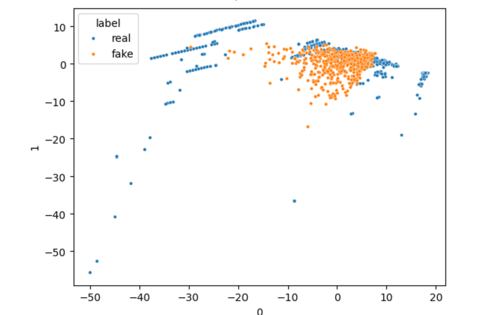

# 🧠 Data Balancing with Generative AI: Credit Card Fraud Detection

This project tackles the common challenge of class imbalance in credit card fraud detection by leveraging Generative Adversarial Networks (GANs) to create synthetic fraud transaction data. The goal is to improve machine learning model performance by generating realistic synthetic samples of the minority class.

## 📌 Business Problem

Credit card fraud is a rare yet high-impact event. Traditional oversampling techniques (e.g., SMOTE) may not accurately replicate the distribution of fraudulent transactions. This project uses GANs to create realistic synthetic fraud samples that balance the dataset and enhance model recall and F1-score — ultimately improving fraud detection efficiency.

## ⚙️ Technologies & Tools Used

- Python 🐍
- Pandas, NumPy, Matplotlib, Seaborn
- Scikit-learn
- TensorFlow / Keras (GANs)
- PCA (Principal Component Analysis)
- ML Algorithms: Logistic Regression, Random Forest, XGBoost

## 🔍 Key Steps

1. **Data Preprocessing** – Normalized and cleaned the dataset for training.
2. **Imbalance Analysis** – Visualized class distribution showing imbalance.
3. **GAN Training** – Developed and trained a GAN to synthesize fraud data.
4. **PCA Visualization** – Compared real vs. synthetic data using PCA plots.
5. **Model Evaluation** – Compared model performance with/without GAN data.
6. **Performance Boost** – Demonstrated improved F1-score and recall.

## 🧠 GAN Model Summary

- The **Generator** network learns to produce realistic fraud samples from noise.
- The **Discriminator** learns to distinguish between real and fake transactions.
- Together, the adversarial setup drives the generator to create highly realistic data.

## 📸 Real vs. Synthetic Data (PCA Visualization)

The following PCA plot illustrates how closely the **synthetic fraud samples (orange)** generated by the GAN align with the **real fraud transactions (blue)** in the feature space.

> Blue = Real Fraud | Orange = Synthetic Fraud  
> A strong overlap indicates successful data generation and realistic learning by the GAN.

## 🤔 Why This Project?

This project demonstrates the practical use of **Generative AI** in fraud analytics. By combining GANs and machine learning, it showcases an advanced technique to solve real-world problems like data imbalance, making it ideal for a data science and AI portfolio.

